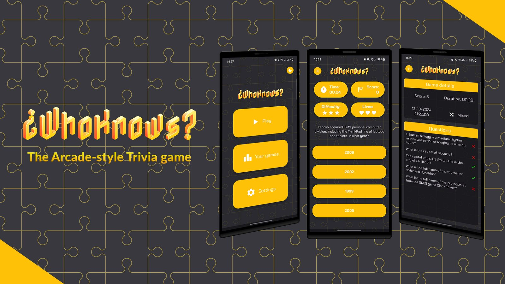
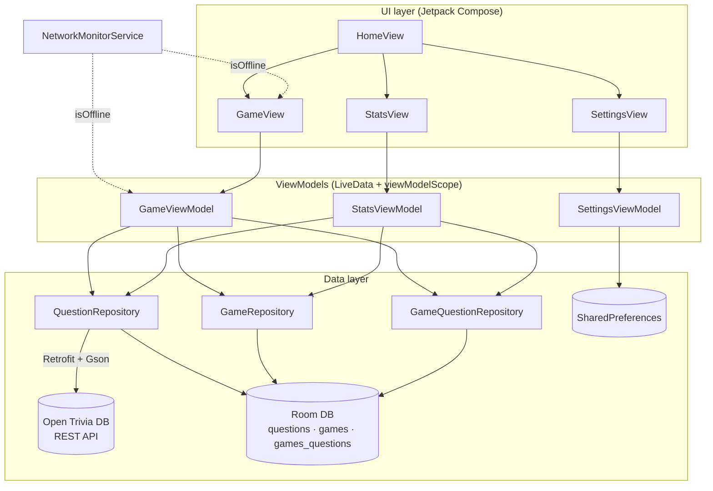
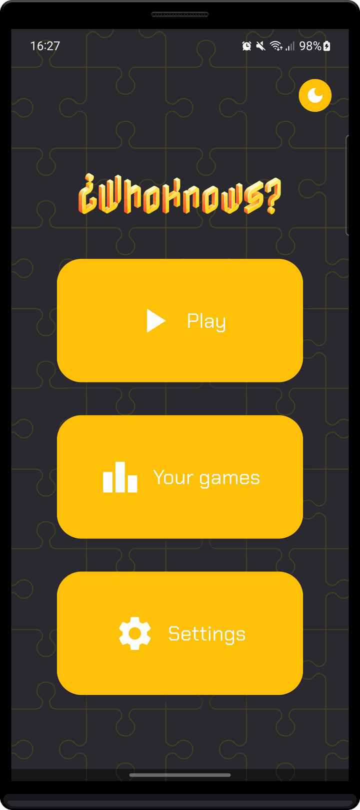
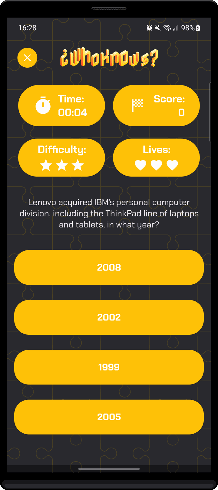
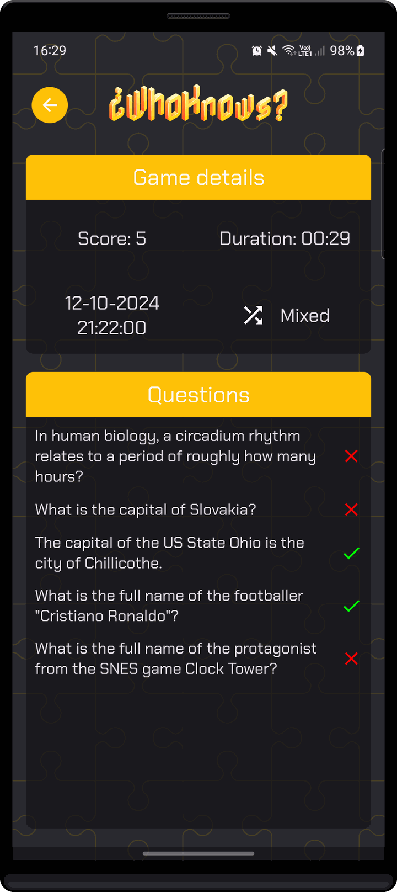

<p align="center">
  
</p>

# ¿WhoKnows?: Android Trivia Game

[](https://github.com/DeveloperMatt02/whoknows-android-trivia/releases/latest)


-3DDC84.svg?logo=android&logoColor=white)

[](https://github.com/DeveloperMatt02/whoknows-android-trivia/actions/workflows/android-ci.yml)


> Developed for the **Mobile Programming** course, University of Rome Tor Vergata (A.Y. 2023/24)

**¿WhoKnows?** is a native Android trivia game written in **Kotlin** with **Jetpack Compose**. Questions come live from the public [Open Trivia Database](https://opentdb.com/) API, every game you play is stored in a local **Room** database so you can review it later, and all I/O runs on **Kotlin coroutines** so the UI never blocks.

## 🚀 Overview

The game is a survival quiz. You pick a category and a difficulty, then answer one question after another until you run out of lives. Harder questions are worth more points, and your best score is tracked as a personal record.

The app follows **MVVM with a Repository layer**. Compose screens observe `LiveData` exposed by ViewModels. The ViewModels coordinate game logic and delegate data access to repositories, which hide the two data sources: the OpenTDB REST API (Retrofit) and the local SQLite database (Room). A background `Service` monitors connectivity, so the game reacts gracefully when the network drops.

### Key Features

1. **Survival gameplay:** 3 lives, one lost per wrong answer. Correct answers score 1, 2 or 3 points depending on difficulty, and a "New record!" banner celebrates a new personal best.
2. **Live question bank:** categories are downloaded from OpenTDB at startup. You can play one category or *Mixed*, at *Easy*, *Medium*, *Hard* or *Mixed* difficulty.
3. **No repeated questions:** an OpenTDB **session token** guarantees unique questions within a session. When the token is exhausted, it is reset automatically.
4. **Persistent game history:** every game (score, category, difficulty, duration, date) and every question you saw, including the answer you gave, is saved with Room. A details screen shows each question with ✓ or ✗.
5. **Offline-aware:** connectivity is monitored in real time. If the connection drops mid-game, the timer pauses and a dedicated screen lets you wait for the network or quit and save the game. The history stays fully available offline.
6. **Rate-limit friendly:** API calls are throttled to respect OpenTDB's limit of one request every 5 seconds, while the game timer is paused during the wait.
7. **Polished UX:** animated hearts and score counter, colour and sound feedback on every answer, a looping soundtrack, a persisted light/dark theme and sound toggle, and dedicated **portrait and landscape** layouts.

## 🧠 Architecture Diagram



## 🛠️ Tech Stack

*   **Language:** [Kotlin](https://kotlinlang.org/) 1.9
*   **UI:** [Jetpack Compose](https://developer.android.com/jetpack/compose) with [Material 3](https://m3.material.io/) and [Navigation Compose](https://developer.android.com/jetpack/compose/navigation)
*   **Architecture:** MVVM + Repository, [Android ViewModel](https://developer.android.com/topic/libraries/architecture/viewmodel) and [LiveData](https://developer.android.com/topic/libraries/architecture/livedata)
*   **Concurrency:** [Kotlin Coroutines](https://kotlinlang.org/docs/coroutines-overview.html) (`viewModelScope`, `Dispatchers.IO`, suspend DAOs)
*   **Networking:** [Retrofit](https://square.github.io/retrofit/) + [Gson](https://github.com/google/gson), with a custom deserializer for HTML entities
*   **Persistence:** [Room](https://developer.android.com/training/data-storage/room) (SQLite) and SharedPreferences
*   **Build & CI:** Gradle Kotlin DSL with a version catalog, and GitHub Actions
*   **Data source:** [Open Trivia Database](https://opentdb.com/api_config.php)

## 📖 Documentation

*   [Architecture Overview](docs/ARCHITECTURE.md): layers, navigation, concurrency model, network and offline handling
*   [Technical Design Document](docs/TECHNICAL_DESIGN.md): game rules, API integration, database schema
*   [Requirements](docs/REQUIREMENTS.md): user stories and functional and non-functional requirements

## 📱 Screenshots

| Home | In game | Game details |
|:---:|:---:|:---:|
|  |  |  |
| Animated title and theme toggle | Timer, score, difficulty and lives | Past games, question by question |

## 🚦 Getting Started

### Download the APK

Ready-to-install builds are attached to every [GitHub Release](https://github.com/DeveloperMatt02/whoknows-android-trivia/releases). Download the `.apk` on an Android 9+ device and allow installation from unknown sources. The latest successful CI build is also available as an artifact from the [Actions tab](https://github.com/DeveloperMatt02/whoknows-android-trivia/actions).

### Prerequisites (to build from source)
*   [Android Studio](https://developer.android.com/studio) (Koala or newer) or the command-line Android SDK with API 34
*   JDK 17
*   An emulator or device running Android 9.0 (API 28) or higher, with an Internet connection

### Installation

1.  **Clone the repository**
    ```bash
    git clone https://github.com/DeveloperMatt02/whoknows-android-trivia.git
    cd whoknows-android-trivia
    ```

2.  **Open in Android Studio**
    Choose *File → Open*, select the project folder and let Gradle sync. No API key is needed, because Open Trivia DB is free and public.

### Running the App

From Android Studio, select a device and press **Run ▶**. From the command line:
```bash
./gradlew installDebug          # build and install on a connected device/emulator
```

### Running the Tests
```bash
./gradlew testDebugUnitTest     # JVM unit tests (game rules, Room converters, connectivity tracking, retry logic)
```

## 📂 Project Structure

```text
whoknows-android-trivia/
├── app/
│   ├── build.gradle.kts
│   └── src/
│       ├── main/
│       │   ├── java/it/scvnsc/whoknows/
│       │   │   ├── MainActivity.kt          # Entry point, NavHost, lifecycle hooks
│       │   │   ├── data/
│       │   │   │   ├── dao/                 # Room DAOs (suspend functions)
│       │   │   │   ├── db/                  # Room database singleton
│       │   │   │   ├── model/               # Entities: Question, Game, GameQuestion
│       │   │   │   └── network/             # Retrofit ApiService, API responses, NetworkResult
│       │   │   ├── repository/              # Question / Game / GameQuestion repositories
│       │   │   ├── services/                # NetworkMonitorService (connectivity)
│       │   │   ├── ui/
│       │   │   │   ├── screens/views/       # Home, Game, Stats, Settings screens
│       │   │   │   ├── screens/components/  # Shared TopBar, AutoResizeText
│       │   │   │   ├── theme/               # Colours, typography, dimensions
│       │   │   │   └── viewmodels/          # Game, Stats, Settings ViewModels
│       │   │   └── utils/                   # GameRules, converters, deserializer, helpers
│       │   └── res/                         # Fonts, sounds, drawables
│       └── test/                            # JVM unit tests
├── docs/
│   ├── ARCHITECTURE.md, TECHNICAL_DESIGN.md, REQUIREMENTS.md
│   ├── images/                              # Banner, logo, social preview, puzzle pattern
│   └── screenshots/                         # App screenshots used in this README
├── .github/workflows/                       # CI and release pipelines
└── gradle/libs.versions.toml                # Dependency version catalog
```

## 🗺️ Known Limitations & Roadmap

This is a university project, and I'm listing its limits openly:

*   Questions are fetched one at a time, so a **new game needs a connection**. Only the history works offline. Prefetching a small buffer of questions would enable true offline play.
*   Dependencies are wired by hand inside the ViewModels. **Hilt** would make them injectable and testable.
*   State is exposed as `LiveData`. `StateFlow` with a single UI-state class per screen would be the modern equivalent.
*   Room uses `fallbackToDestructiveMigration()`. Real migrations would be needed before any public release.
*   UI strings are hard-coded in English. Moving them to `strings.xml` would enable localisation.

## 📜 Project History

The app was built by a team of students between August 2024 and January 2025 as the course project for Mobile Programming. The full original commit history is preserved in this repository. In 2026 the project was reorganised for open-source publication: documentation, CI, unit tests, dependency cleanup and fixes for a few crash-prone paths (network errors mid-game, token exhaustion, a busy-wait loop on the main thread).

## 👥 Team

Developed by:
*   **Nicolas Oberi** ([@snyppololo](https://github.com/snyppololo))
*   **Matteo Trossi** ([@DeveloperMatt02](https://github.com/DeveloperMatt02))


## 🙏 Credits

*   Trivia questions: [Open Trivia Database](https://opentdb.com/), licensed under [CC BY-SA 4.0](https://creativecommons.org/licenses/by-sa/4.0/)
*   Logo, puzzle pattern and promotional artwork: created by the ¿WhoKnows? team (see [`docs/images`](docs/images))
*   Fonts: [Chakra Petch](https://fonts.google.com/specimen/Chakra+Petch) and [Nabla](https://fonts.google.com/specimen/Nabla), licensed under the [SIL Open Font License 1.1](https://openfontlicense.org/)

## 📄 License

This project is licensed under the GNU General Public License v3.0. See the [LICENSE](LICENSE) file for details.
